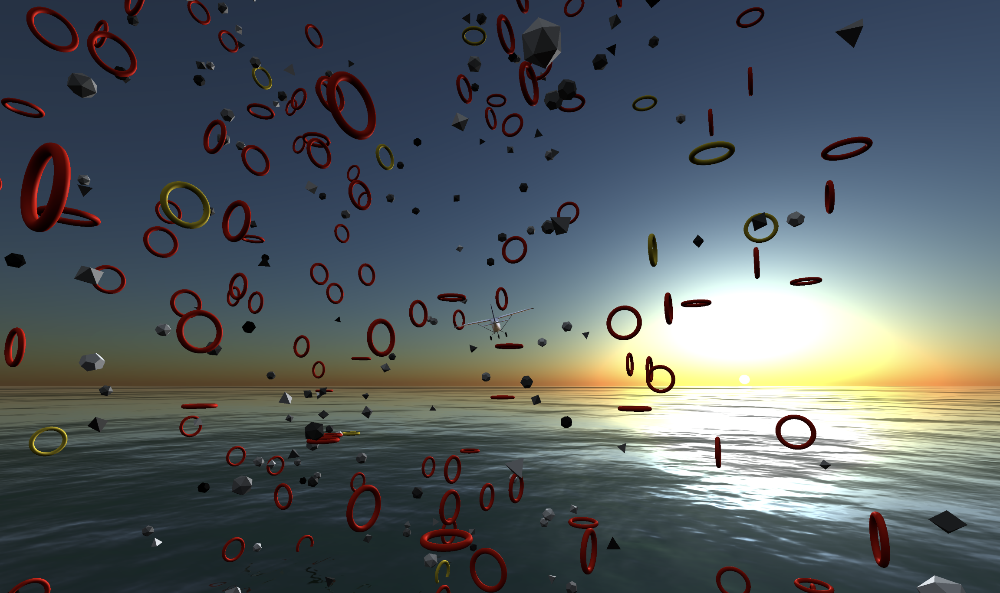

  
  
  # Hi there, I'm Johannes Brandenburger 👋

  
  
  
  

  📍 Mengen, Germany

## 🚀 About Me

Hello! I am Johannes, a passionate software developer and engineer. I completed my dual studies at Geberit and am now advancing my expertise by pursuing a Master's in Software Engineering in Konstanz, Germany. Since February, I have been writing my thesis at Siemens Logistics. In addition, I work as a freelance developer and consultant for various companies and realize my own side projects in my favorite topics of software engineering.

## 🛠️ Skills

### Technical Skills

### Soft Skills
- Leadership Qualities ("You take on a very central role in planning and team communication")
- Customer Orientation ("Your comprehensible and positive interaction with the CPOs is striking in a positive sense")
- Communication Skills ("You communicate with great commitment and authenticity")

## 🎓 Education

| Degree | University | Location | Period | Avg | Thesis |
|--------|------------|----------|--------|-----|--------|
| Master of Science in Software Engineering | University of Applied Sciences Konstanz | Konstanz, Germany | 2023 - Expected 2025 | 1.1 | - |
| Bachelor of Science in Computer Science (Information Technology) | DHBW Ravensburg (Cooperative State University) | Ravensburg, Germany | 2020 - 2023 | 1.2 | "Zentrale Plattform für die Analyse und Verwaltung der Code-Sicherheit in Unternehmenssoftwaresystemen" (1.0) |

## 💼 Professional Experience

| Position | Company | Location | Period | Infos |
|----------|---------|----------|--------|---------------------|
| Master's Student | Siemens Logistics | Konstanz, Germany | Feb 2025 - Present | • Writing my master's thesis in the field of airport sort allocation optimization |
| Independent Software Developer and Consultant | Brandenburger IT Solutions | Mengen, Germany | Sep 2023 - Present | • Among others, worked for Geberit and Westermann Verlag. • Full-stack development and software architecture • Mostly combining open-source technologies and SAP infrastructure for innovative employee applications |
| Corporate Student | Geberit | Pfullendorf, Germany | Oct 2020 - Sep 2023 | • Visited all IT departments of the company • Stay abroad to work in a Geberit subsidiary in Italy for several months • Worked on real projects in an international business environment • Developed a full-stack application for security checks used in production |

## 🚀 Featured Projects

### Know Where You Go

Open-source Google Maps Alternative built with React and Leaflet.

&nbsp;&nbsp;

---

### Geberit: Central Platform for Analysis of Code Security in Enterprise Software Systems

Full-stack cloud native application for security analysis of [ABAP](https://en.wikipedia.org/wiki/ABAP) code. Presented on ABAPConf 2023 ([YouTube](https://www.youtube.com/live/hleq0-NTVQo?si=9nZnpXVj0ss_TG6l&t=23324)).

---

### Flight Simulator Online 3D Game

Small 3D browser game using three.js

&nbsp;&nbsp;

---

### Reveal the World: Cloud Native Travel Map App

A Web-App with Docker, Kubernetes, Terraform and Express made for running on Azure

---

### User Authentication using Voice Recognition

A student research project concerning the topic of user authentication using voice recognition. The aim of the work was to find the optimal combination of the speaker features LPC, LPCC, MFCC and Delta MFCC for authentication using a neural network (TensorFlow).

---

### Generalized Iterative Closest Point Implementation

Own implementation of the Generalized Iterative Closest Point (GICP) algorithm in Python for vizualization and evaluation of the algorithm. The algorithm is finds the optimal transformation between two point clouds and is used to localize a robot using lidar data.

---

### Typst MCP Server

A MCP server implementation that helps large language model agents to generate Typst documents.

---

### HTWG Mobile App

Student project in which we develop a mobile app for the students of the University of Applied Sciences Konstanz. Technologies used: Flutter, Quarkus, Docker

---

### Resume - All in One and resumee.cloud

Open-source resume generator for professionals that allows to define resume data in JSON format and then generates a nice web portfolio and a professional PDF resume. Additionally, I created a SaaS version of the generator at resumee.cloud, that allows users to create their own online resume without any coding. Technologies used: Next.js, Aceternity UI, Typst, Prisma, tRPC

---

### Student Project: Kudo Platform

We worked with [Sybit GmbH](https://www.sybit.de/) on a Kudo platform as part of the project for the Master's lectures 'Agile Process Models' and 'Mobile Communication and Collaboration'. I was the product owner of my group and therefore always in contact with the chief product owners.

---

### Assembly-Timediff

Program that evaluates timestamps, written in assembly x86-64

